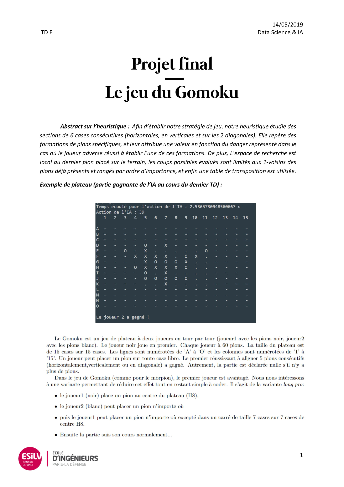
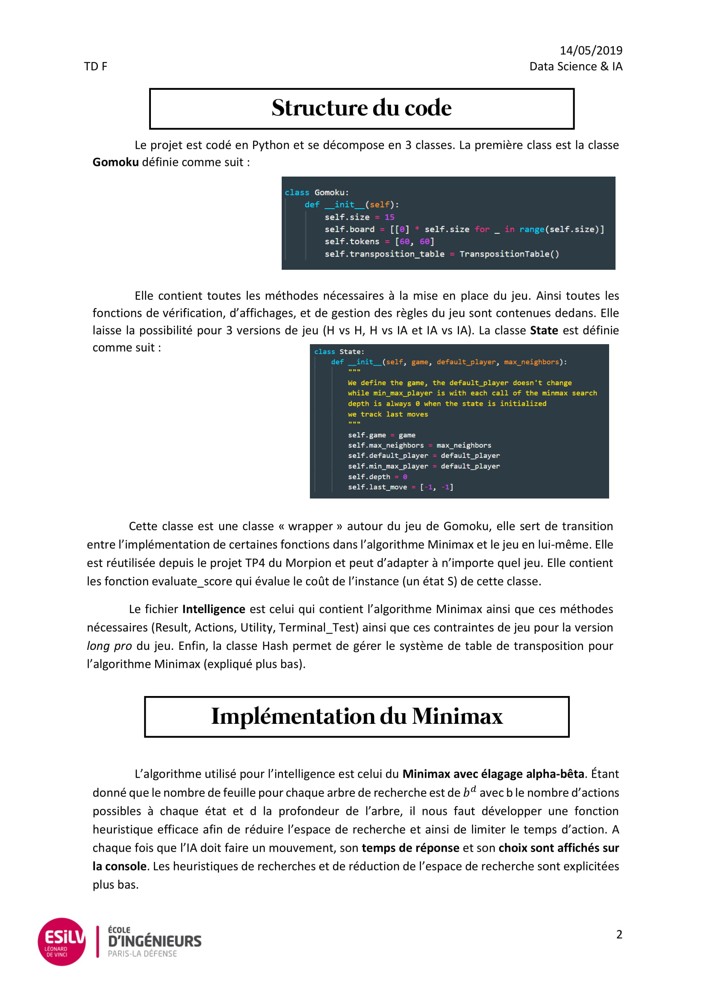
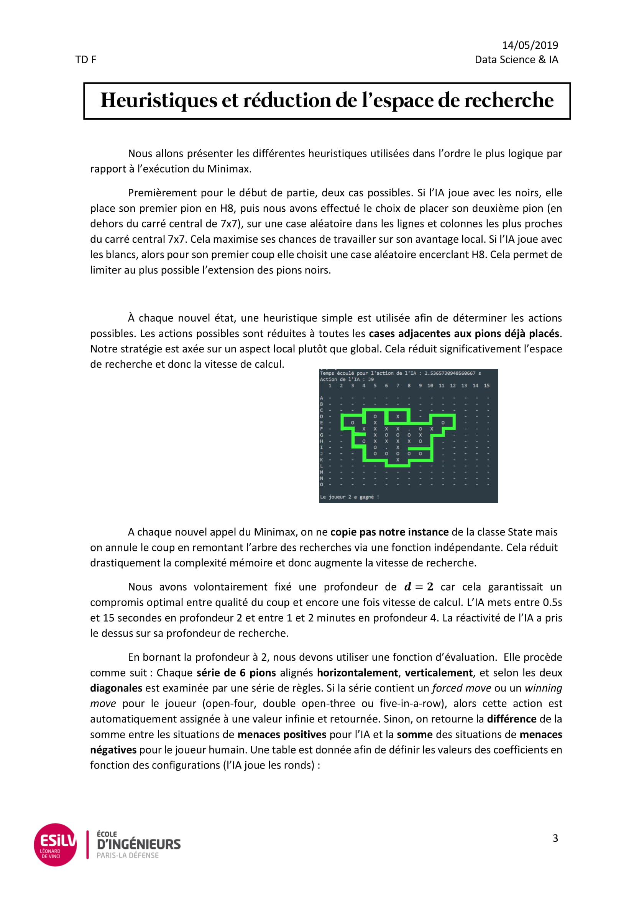
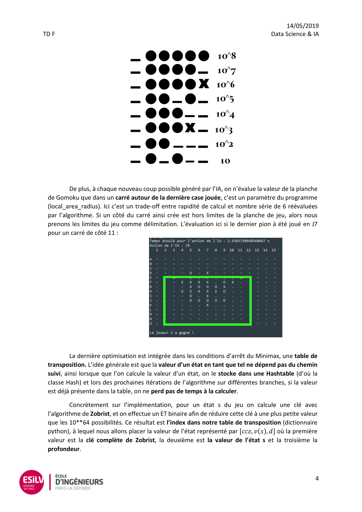

# Minimax-alpha-beta
This project was realized for the Introduction to DataScience course @ESILV university.

## Description 
It implements the minimax alpha-beta pruning algorithm to find the best move given deterministic games. It was optimized with various heuristics for each of the games, as well as a hash table for large-state games like Go. 
It solves Tic-Tac-Toe to perfect match, and gives good results for Connect 4 and Gomoku games. The docs are mainly on the Gomoku game because it was the main project.

## Docs

